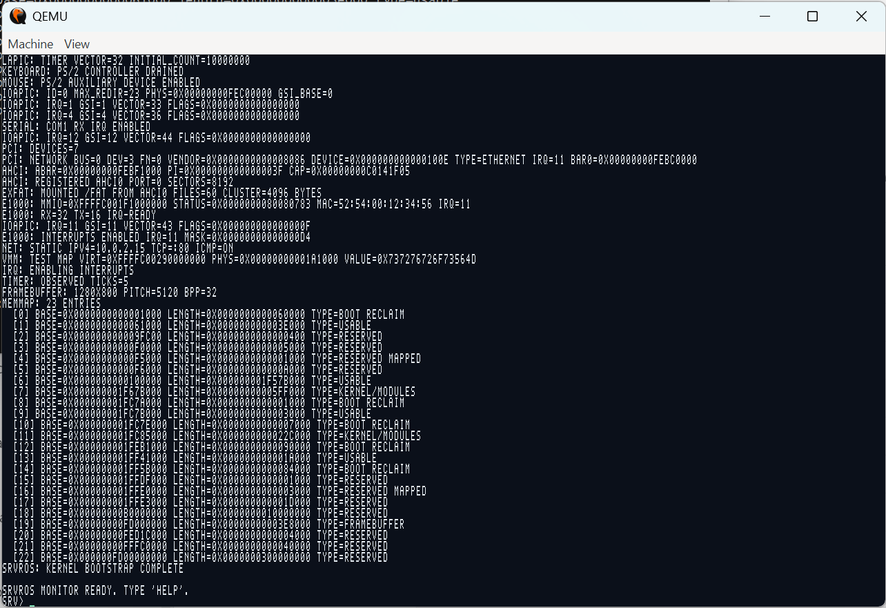
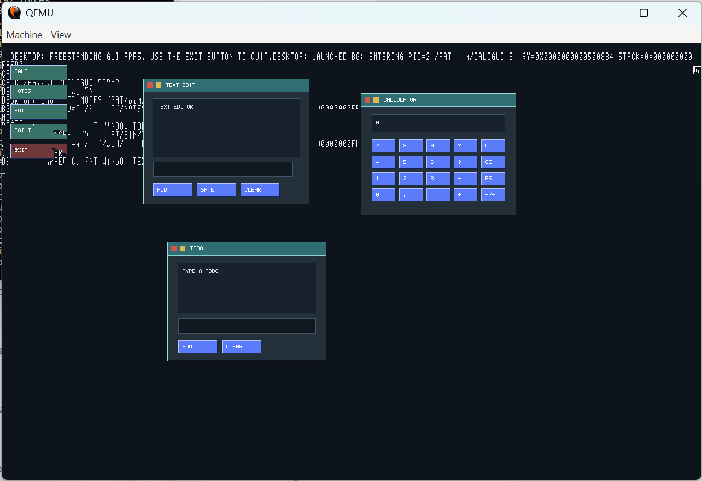

# srvros

srvros is a from-scratch x86_64 operating system and minimal userspace. It boots
through Limine, enters a higher-half kernel, runs ring-3 ELF programs with
preemptive scheduling, mounts an exFAT filesystem from AHCI or initramfs-backed
block devices, and can run a userspace web server on a small in-kernel TCP/IP
stack.

This is an early research OS, but it is already useful as a compact playground
for kernel, filesystem, networking, shell, and GUI experiments.

## Screenshots

Booted kernel monitor with AHCI, exFAT, e1000, and memory-map diagnostics:



Userspace desktop/window server with freestanding calculator, notes, and text
editor clients:



## Current Features

- Limine BIOS/UEFI ISO boot path for x86_64.
- Higher-half freestanding C kernel with GDT, IDT, TSS, exception handling, and
  serial plus framebuffer console output.
- Physical frame allocator, kernel heap, virtual memory manager, per-process
  page tables, and user pointer validation.
- Local APIC timer, IOAPIC routing, PS/2 keyboard, PS/2 mouse, and IRQ-backed
  COM1 serial input.
- FPU/SSE/SSE2 enablement with per-process and per-scheduler-thread
  `fxsave64`/`fxrstor64` state preservation across traps, syscalls,
  preemption, and kernel/user transitions.
- Preemptive scheduler for kernel threads and ring-3 processes, wait queues,
  process table, foreground/background tasks, `ps`, `kill`, and `wait`.
- USTAR initramfs and VFS layer.
- Generic block-device registry, memory block devices, AHCI SATA read/write
  support, and a small write-through block cache.
- exFAT mounting, recursive directory traversal, file reads, file create/write,
  append, delete, rename, directory create, empty directory removal, runtime
  mount/unmount, and `fsck`-style consistency checks.
- Intel e1000 driver with RX/TX rings, interrupt-driven receive wakeups, ARP,
  ICMP echo replies, DHCP, DNS A-record resolution, and a small TCP subset.
- Process-owned network file descriptors with `listen`, `accept`, `read`,
  `write`, and `close`.
- Ring-3 `/fat/bin/webd`, a poll-driven static HTTP server for `/fat/www` with
  nested asset paths, content lengths, MIME types, cache headers, idle cleanup,
  and a bounded active-client table.
- Shell with PATH lookup, builtins, foreground/background jobs, stdin/stdout/
  stderr redirection, pipeline output redirection, multi-stage pipelines,
  scripts, `$VAR`/`${VAR}`, `$?`/`$$` expansion, unquoted `*`/`?` globbing,
  `&&`/`||`, `test`/`[`, `service webd`, DHCP/status/DNS commands,
  `env`/`export`/`which`, and basic Unix-like tools.
- Userspace support library with syscall wrappers, conio-style console helpers,
  framebuffer drawing, mouse polling, BMP helpers, a shared `crt0.S` startup
  object for static ELF apps, and a small widget toolkit.
- First POSIX-compat headers/wrappers for file I/O, directories, errno, malloc,
  `sbrk`, pipes, `dup`/`dup2`, `poll`/`select`, `fcntl`/`O_NONBLOCK`,
  `access`, `isatty`, `fsync`, `truncate`/`ftruncate`, `pread`/`pwrite`, time,
  cwd, `getopt`, `uname`, environment variables, `waitpid`, `posix_spawn`,
  `posix_spawnp`, compatibility `execve`, IPv4 helpers, DNS-backed
  `getaddrinfo`, and TCP server sockets.
- Minimal `stdio` plus early libc/POSIX shims for third-party ports:
  `/fat/bin/zlibdemo` links pinned zlib and `/fat/bin/lua` runs a pinned Lua
  5.4.8 floating-profile interpreter with `math`, basic file IO, and pure-Lua
  `require`. The support library also exports the first newlib-style syscall
  hooks, `float.h`, and small built-in `math.h`, `printf`, and `scanf`
  surfaces.
- `/fat/bin/fpdemo` stress-tests userspace double math across foreground and
  background preemption.
- `/fat/bin/tap` splits an input stream to stdout and a secondary file, and is
  covered in the shell pipeline smoke path.
- The first `execve`-shaped native launch path accepts an argv vector, an envp
  vector, background flags, and explicit stdin/stdout/stderr fd overrides.
  The POSIX layer exposes this as `posix_spawn`/`posix_spawnp`, `waitpid`, and a
  temporary spawn-and-wait `execve` compatibility wrapper until true process
  image replacement lands.
- GUI experiments: fullscreen desktop/window server, freestanding calculator,
  notes, text editor, and BMP paint/image editor clients.

## Repository Layout

```text
boot/                 Limine boot configuration
docs/                 Architecture, roadmap, testing, and release notes
initramfs/            Static files copied into the boot initramfs
kernel/include/       Kernel headers
kernel/src/           Kernel, drivers, VFS, scheduler, network, and filesystem
shared/include/       ABI shared between kernel and userspace
tools/                Image builder and QEMU smoke/stress harnesses
ports/                Pinned upstream sources staged for future ports
userspace/            Freestanding ring-3 apps and support library
```

## Tooling

Builds are driven from MSYS2 UCRT64 on Windows. The Makefile expects UCRT64
`make`, `git`, `curl`, `unzip`, `xorriso`, Python 3, and QEMU. It downloads a
self-contained Zig toolchain into `build/tooling/zig` and uses Zig cc plus LLD
for freestanding C/assembly builds.

From an MSYS2 UCRT64 shell:

```sh
cd /c/Users/Paul/Desktop/srvros
make -j4
```

The main artifacts are:

```text
build/srvros-x86_64.iso
build/srvros.exfat
build/initramfs.tar
```

## Running

Interactive QEMU:

```sh
make run
```

Networked QEMU with host TCP port 8080 forwarded to guest port 80:

```sh
make run-net
```

Networked QEMU with `/fat` mounted from an AHCI-attached exFAT disk:

```sh
make run-ahci-net
```

Two AHCI exFAT disks, with `ahci0` mounted at `/fat` and `ahci1` available for
manual mounting:

```sh
make run-ahci2-net
```

## Trying the Shell

At the kernel monitor:

```text
srv> run /fat/bin/sh
```

Inside the userspace shell:

```text
/ $ help
/ $ ls /fat/bin
/ $ mkdir /fat/projects
/ $ write /fat/projects/readme.txt hello
/ $ mv /fat/projects/readme.txt /fat/projects/renamed.txt
/ $ cat /fat/projects/renamed.txt
/ $ rm /fat/projects/renamed.txt
/ $ rmdir /fat/projects
```

Network commands under `make run-ahci-net` or another e1000 QEMU target:

```text
/ $ dhcp
/ $ net
/ $ dns p2.dev
/ $ service webd start
/ $ posixdemo
/ $ zlibdemo
/ $ lua -e "print('hello from lua', 6*7)"
```

Then from the host:

```sh
curl http://127.0.0.1:8080/
curl http://127.0.0.1:8080/status.txt
```

The login shell starts `/fat/etc/init.sh`:

```text
srv> run /fat/bin/sh --login
```

## Useful Monitor Commands

```text
help
clear
mem
heap
ticks
workers
block
mount
mount ahci1 /disk
unmount /disk
fsck /fat
pci
net
ps
run /path
bg /path
kill <pid>
ls [path]
cat /path
write /fat/name text
```

## Smoke Tests

The Python harnesses boot the built ISO in QEMU and drive the serial console:

```sh
python3 tools/cli_smoke.py --qemu /ucrt64/bin/qemu-system-x86_64
python3 tools/dir_smoke.py --qemu /ucrt64/bin/qemu-system-x86_64
python3 tools/dhcp_smoke.py --qemu /ucrt64/bin/qemu-system-x86_64
python3 tools/dns_smoke.py --qemu /ucrt64/bin/qemu-system-x86_64
python3 tools/ports_smoke.py --qemu /ucrt64/bin/qemu-system-x86_64
python3 tools/lua_smoke.py --qemu /ucrt64/bin/qemu-system-x86_64
python3 tools/web_smoke.py --qemu /ucrt64/bin/qemu-system-x86_64
python3 tools/process_smoke.py --qemu /ucrt64/bin/qemu-system-x86_64
python3 tools/fs_stress.py --qemu /ucrt64/bin/qemu-system-x86_64 --rounds 1
```

See [docs/testing.md](docs/testing.md) for the full release verification pass.

## Documentation

- [Architecture](docs/architecture.md)
- [Testing](docs/testing.md)
- [Porting](docs/ports.md)
- [Executable Format](docs/executable-format.md)
- [Roadmap](docs/roadmap.md)
- [Release notes](docs/release-notes.md)

## License

srvros is released under the [MIT License](LICENSE).

## Status

srvros is not production software. There is no security boundary worth trusting
yet, the TCP stack is intentionally small, the filesystem code favors clear
milestone behavior over crash-proof journaling, and device support is centered on
QEMU's common x86_64 devices. It is, however, a working base for continuing
toward a self-hosted shell, richer storage support, stronger networking, and a
more capable userspace.
