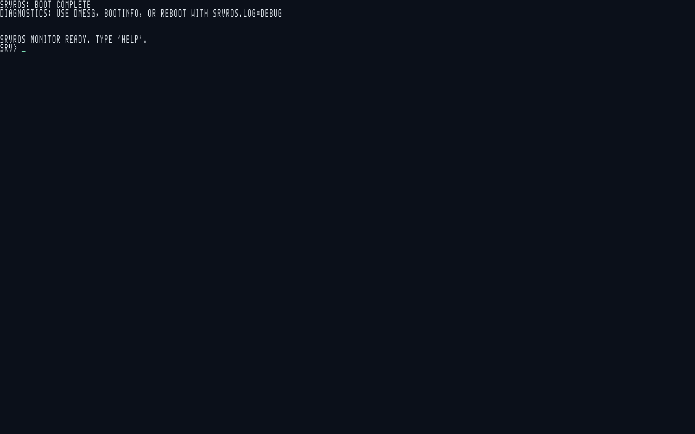
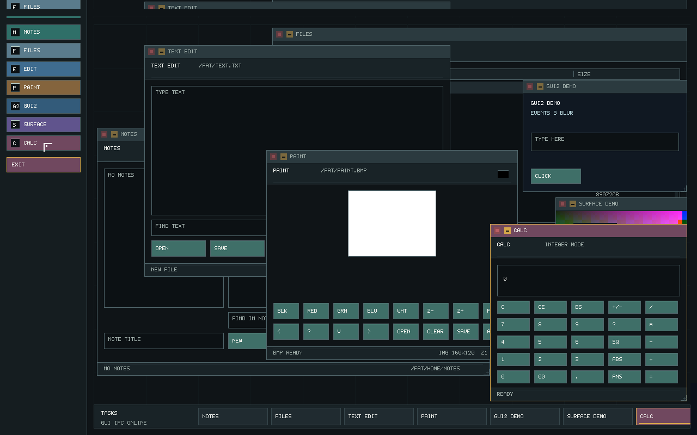

# srvros

srvros is a from-scratch x86_64 operating system and minimal userspace. It boots
through Limine, enters a higher-half kernel, runs ring-3 ELF programs with
preemptive scheduling, mounts an exFAT filesystem from AHCI or initramfs-backed
block devices, and can run a userspace web server on a small in-kernel TCP/IP
stack.

This is an early research OS, but it is already useful as a compact playground
for kernel, filesystem, networking, shell, and GUI experiments.

## Screenshots

Booted kernel monitor with AHCI, exFAT, e1000, and memory-map diagnostics:



GUI desktop with freestanding calculator, notes, and text editor clients:



## Current Features

- Limine BIOS/UEFI ISO boot path for x86_64.
- Higher-half freestanding C kernel with GDT, IDT, TSS, exception handling, and
  serial plus framebuffer console output, including a small framebuffer-side
  ANSI CSI subset for cursor movement and clear-screen/clear-line sequences.
- Physical frame allocator, kernel heap, virtual memory manager, per-process
  page tables, and user pointer validation.
- Local APIC timer, IOAPIC routing, PS/2 keyboard, PS/2 mouse, and IRQ-backed
  COM1 serial input.
- FPU/SSE/SSE2 enablement with per-process and per-scheduler-thread
  `fxsave64`/`fxrstor64` state preservation across traps, syscalls,
  preemption, and kernel/user transitions.
- Preemptive scheduler for kernel threads and ring-3 processes, wait queues,
  process table with parent PID and executable-path metadata,
  foreground/background tasks, `ps`, `kill`, and `wait`.
- USTAR initramfs and VFS layer.
- Generic block-device registry, memory block devices, AHCI SATA read/write
  support, and a small write-through block cache.
- exFAT mounting, recursive directory traversal, file reads, file create/write
  with fragmented FAT-chain fallback, append, delete, rename, directory create,
  empty directory removal, runtime mount/unmount, and `fsck`-style consistency
  checks.
- Intel e1000 driver with RX/TX rings, interrupt-driven receive wakeups, ARP,
  ICMP echo replies, DHCP, DNS A-record resolution, and a small TCP subset.
- Process-owned network file descriptors with `listen`, `accept`, `read`,
  `write`, and `close`.
- Ring-3 `/fat/bin/webd`, a poll-driven static HTTP server for `/fat/www` with
  nested asset paths, content lengths, MIME types, cache headers, idle cleanup,
  a bounded active-client table, `/__status` counters, and init-owned service
  logging under `/fat/var/log`.
- Shell with PATH lookup, builtins, foreground/background jobs, stdin/stdout/
  stderr redirection, pipeline output redirection, foreground/background
  multi-stage pipelines,
  scripts, `sh -c`, `$VAR`/`${VAR}` including default/assign/alternate/error
  parameter forms, `${#VAR}`, prefix/suffix trims, `$?`/`$$`/`$!` expansion,
  `$(command)` substitution, integer arithmetic expansion with `$((expr))`,
  positional parameters (`$0`, `$1`, `$#`, `$@`), unquoted `*`/`?`
  globbing, `&&`/`||`, compound-command tail chaining with `;`/`&&`/`||`,
  command-local `NAME=value`, comments, script line continuations, here-docs,
  current-shell `{ ...; }` grouping,
  `if`/`then`/`else`/`fi`, `for`/`in`/`do`/`done`,
  `while`/`do`/`done`, `case`/`in`/`esac`, shell functions with `return`, `shift`,
  loop `break`/`continue`,
  `/fat/etc/profile`, `PS1`, default `TMPDIR`, `HISTFILE`/`HISTSIZE`,
  `test`/`[`, `set -e`, `read`, `alias`, `history`, `type`, `command -v`/`command -V`,
  `unset`, safer `cd`, `jobs`/`jobs -l`/bare `wait` draining tracked jobs/
  `fg`/`bg`/`kill`, `%+`/`%-` job references, config-backed `service`
  management for `/fat/etc/services/*.svc`,
  DHCP/status/DNS commands,
  `env`/`export`/`which`, `env NAME=value command`, `exec`, quote/block diagnostics, Ctrl-C prompt
  recovery, raw-mode line editing with cursor movement, Ctrl-U/Ctrl-W kill,
  Ctrl-Y yank, draft-preserving history navigation,
  Ctrl-C foreground job and pipeline interruption with
  `128 + signal` statuses,
  canonical relative paths with `.`/`..`, `help -l`, `man <topic>`,
  `apropos <word>`, tab completion for commands, help topics, service names,
  and filesystem paths, and Unix-like tools
  including option-aware `grep`, `head`, `tail`, `wc`, `find`, `ls`, and
  `sed`, `expr`, `printf`, `tr`, `dd`, `tee`, `du`, `df`, `sort`, `uniq`, `cut`, `xargs`, `seq`, `realpath`,
  `id`, `whoami`, `readlink`, `cmp`, `yes`, `install`, `diff`, `tar`, `gzip`, `gunzip`, `minizip`, `miniunz`, `patch`, `make`, `byacc`, `mktemp`,
  `ln`, `sync`, external `test`/`[`, `cksum`, `sum`, `comm`, `paste`, `join`,
  `split`, `od`, `hexdump`, `strings`, `file`, `tty`, `stty`, `time`,
  `timeout`, `nohup`, and `nice`,
  `mkdir -p`, clustered `rm -fRr`, multi-source `cp`/`mv` into directories,
  recursive `cp`/`rm`, directory-aware `mv`, and common long-option aliases
  for build-script probes across `grep`, `sed`, `xargs`, `tar`, `make`, `ls`,
  `cp`, `rm`, `mv`, `mkdir`, `install`, `tee`, `head`, `tail`, `wc`, and `ln`,
  `more`, `uname`, `hostname`, and `uptime`.
- Generated exFAT images include `/fat/share/help`, `/fat/share/examples`,
  `/fat/etc/profile.d`, `/fat/tmp`, and `/fat/home`; `help <topic>`/`man
  <topic>` print topic files, `apropos <word>` searches them, `/fat/bin/more`
  can page longer text, and the core CLI tools accept `-h`/`--help` plus `--`
  option termination where useful.
- Userspace support library with syscall wrappers, conio-style console helpers,
  framebuffer drawing, mouse polling, BMP helpers, a shared `crt0.S` startup
  object for static ELF apps, and a small widget toolkit.
- First POSIX-compat headers/wrappers for file I/O, directories, errno, malloc,
  `sbrk`, pipes, `socketpair(AF_UNIX, SOCK_STREAM)`, pathname
  `AF_UNIX` stream sockets, `dup`/`dup2` with shared
  regular-file offsets,
  `poll`/`select`, `fcntl`/`O_NONBLOCK`,
  `F_GETFD`/`F_SETFD` close-on-exec flags, `F_GETLK`/`F_SETLK`/`F_SETLKW`
  advisory byte-range locks for regular files, `access`, `isatty`, `fsync`,
  global `sync`,
  `truncate`/`ftruncate`, `pread`/`pwrite`,
  `lstat`, `realpath`, `scandir`, `alphasort`, `limits.h`,
  `readv`/`writev`/`preadv`/`pwritev`, minimal `sendmsg`/`recvmsg`
  scatter/gather data transfer plus bounded `SCM_RIGHTS` fd passing over local
  socketpairs and pathname local sockets, minimal `termios`
  `tcgetattr`/`tcsetattr`, `ioctl` `TIOCGWINSZ`/`TIOCSWINSZ`, `statvfs`, time,
  `nanosleep`, `getpagesize`/`sysconf`, cwd, `getopt`, `uname`, environment
  variables, same-address-space `pthread_create`/`pthread_join`/`pthread_detach`
  with per-thread stacks, pthread TLS keys, static ELF TLS blocks backed by
  `PT_TLS`/`FS.base`, plus pthread mutex/cond/once primitives,
  mutex/cond attributes, recursive mutexes, stack attribute helpers, and
  futex-backed stdio stream locks,
  `waitpid`, `posix_spawn`, `posix_spawnp`, dynamically grown non-stdio spawn
  file actions, reset-id/signal-mask/default spawn attribute storage,
  process-replacing `execve`, IPv4
  helpers, DNS-backed `getaddrinfo`, TCP server sockets, basic socket options
  including `TCP_NODELAY`, accepted-fd option tracking, `accept4`,
  TCP `MSG_PEEK`, and nonblocking TCP connect readiness through
  `poll`/`getsockopt(SO_ERROR)`.
- Minimal `stdio` plus early libc/POSIX shims for third-party ports:
  `/fat/bin/zlibdemo` links pinned zlib, `/fat/bin/minizip` and
  `/fat/bin/miniunz` provide zip archive coverage, and `/fat/bin/lua` runs a
  pinned Lua 5.4.8 floating-profile interpreter with `math`, basic file IO,
  pure-Lua `require`, and an interactive REPL. `/fat/bin/jsondemo` and
  `/fat/bin/inidemo` link pinned cJSON and
  inih for lightweight data/config parsing. The shell uses a srvros linenoise
  port for editable prompts, TAB completion with longest-common-prefix fill,
  and file-backed history, with `/fat/bin/linedemo` covering the history API.
  `/fat/bin/sqlitedemo` links SQLite 3.53.1 through a
  small srvros VFS and verifies create/insert/query/reopen behavior on exFAT.
  `/fat/bin/uvdemo` links the first srvros `uv.h` compatibility shim and
  exercises timer, filesystem operations, async handles, queued work, generic
  fd polling including multi-handle readiness, TCP option helpers, UDP, and
  multi-client host-forwarded TCP listener/read/write
  behavior through a libuv-shaped loop API. Upstream libuv is pinned as a
  submodule under `ports/upstream/libuv` at `v1.52.1`, and
  `/fat/bin/libuvdemo` is the staging harness for growing the srvros backend
  toward that upstream source tree. Its process coverage now includes child
  stdin/stdout pipe wiring, cwd-scoped spawn, duplex stdio pipes,
  inherited-fd/inherited-stream stdin, inherited-stream stdout/stderr, short
  process-only exit loops, and failed-spawn validation cleanup, and its
  platform/filesystem coverage now includes cwd/env/environ/exepath/pid,
  title, passwd/group, uname, uptime/resource, CPU/interface, time/memory,
  syscall-backed random helpers plus fsync, truncate, sendfile, VFS-backed
  timestamp request shims, `uv_fs_poll` file-change polling, and local
  socketpair message I/O with vectored buffers and `SCM_RIGHTS` fd transfer,
  plus `uv_pipe_bind`/`uv_pipe_connect`, `uv_write2`, queued pending
  pipe-handle accept over pathname local sockets, refcounted TCP
  pending-handle typing, and cross-process IPC handle passing over a
  `UV_CREATE_PIPE` child channel.
  The support library also exports the first
  newlib-style syscall hooks, `float.h`, and small built-in `math.h`, `printf`,
  and `scanf` surfaces.
- `/fat/bin/fpdemo` stress-tests userspace double math across foreground and
  background preemption.
- `/fat/bin/tap` splits an input stream to stdout and a secondary file, and is
  covered in the shell pipeline smoke path.
- The native launch path accepts an argv vector, an envp vector, background
  flags, explicit stdin/stdout/stderr fd overrides, and true in-place process
  image replacement for POSIX `execve`; descriptor close-on-exec flags are
  applied during replacement.
- GUI: `/fat/bin/gui` launches the `displayd` compositor, app-owned v2 surface
  clients use `gui2`, and freestanding calculator, notes, text editor, BMP
  paint/image editor, and demo clients are packaged. Legacy `ui` and `desktop`
  remain available for regression coverage.
- The full shipped command surface is tracked in
  [docs/tool-inventory.md](docs/tool-inventory.md), including shell builtins,
  applet aliases, network tools, GUI clients, demos, and regression probes.

## Repository Layout

```text
boot/                 Limine boot configuration
docs/                 Architecture, roadmap, testing, and release notes
initramfs/            Static files copied into the boot initramfs
kernel/include/       Kernel headers
kernel/src/           Kernel, drivers, VFS, scheduler, network, and filesystem
shared/include/       ABI shared between kernel and userspace
tools/                Image builder and QEMU smoke/stress harnesses
ports/                Pinned upstream sources staged for future ports
userspace/            Freestanding ring-3 apps and support library
```

## Tooling

Builds are driven from MSYS2 UCRT64 on Windows. The Makefile expects UCRT64
`make`, `git`, `curl`, `unzip`, `xorriso`, Python 3, and QEMU. It downloads a
self-contained Zig toolchain into `build/tooling/zig` and uses Zig cc plus LLD
for freestanding C/assembly builds.

From an MSYS2 UCRT64 shell:

```sh
cd /c/Users/Paul/Desktop/srvros
make -j4
```

The main artifacts are:

```text
build/srvros-x86_64.iso
build/srvros-usb.img
build/srvros.exfat
build/initramfs.tar
```

Build the GPT/UEFI USB image explicitly with:

```sh
make usb-image
```

`build/srvros-usb.img` is intended for UEFI hardware bring-up. It contains a
FAT32 EFI System Partition plus an exFAT `/fat` data partition. To write it to
real media, use a raw-image writer such as Rufus/Etcher or `dd` from a shell
where you have positively identified the target disk. Writing to the wrong disk
will destroy data.

## Running

Interactive QEMU:

```sh
make run
```

Networked QEMU with host TCP port 8080 forwarded to guest port 80:

```sh
make run-net
```

Networked QEMU with `/fat` mounted from an AHCI-attached exFAT disk:

```sh
make run-ahci-net
```

Two AHCI exFAT disks, with `ahci0` mounted at `/fat` and `ahci1` available for
manual mounting:

```sh
make run-ahci2-net
```

## Trying the Shell

At the kernel monitor:

```text
srv> run /fat/bin/sh
```

Inside the userspace shell:

```text
/ $ help
/ $ help -l
/ $ help service
/ $ man shell
/ $ apropos server
/ $ more /fat/share/help/shell.txt
/ $ sh --login -c 'echo $PROFILE_D $PAGER $EDITOR'
/ $ ls --help
/ $ ls /fat/share/examples
/ $ ls /fat/bin
/ $ mkdir /fat/projects
/ $ write /fat/projects/readme.txt hello
/ $ mv /fat/projects/readme.txt /fat/projects/renamed.txt
/ $ cat /fat/projects/renamed.txt
/ $ rm /fat/projects/renamed.txt
/ $ rmdir /fat/projects
```

Network commands under `make run-ahci-net` or another e1000 QEMU target:

```text
/ $ dhcp
/ $ net
/ $ dns p2.dev
/ $ service webd start
/ $ service webd status
/ $ service list
/ $ cat /fat/var/log/webd.log
/ $ posixdemo
/ $ zlibdemo
/ $ jsondemo
/ $ inidemo
/ $ linedemo
/ $ sqlitedemo
/ $ uvdemo
/ $ libuvdemo
/ $ ttydemo
/ $ ifconfig
/ $ route
/ $ arp
/ $ ping p2.dev
/ $ host linguicityworld.app
/ $ udpdns p2.dev
/ $ udpecho
/ $ netstat
/ $ httpget example.com /
/ $ netcheck
/ $ lua -e "print('hello from lua', 6*7)"
```

Then from the host:

```sh
curl http://127.0.0.1:8080/
curl http://127.0.0.1:8080/status.txt
```

The kernel starts `/init --system` after device and filesystem setup. That
system init runs `/fat/etc/init.sh`, writes startup output to
`/fat/var/log/init.log`, and leaves only a concise boot line on the console:

```text
init: started pid=1
init: startup complete
```

Generated exFAT images include `/fat/etc/services/webd.svc`; `service webd`
uses that config to launch `/fat/bin/webd /fat/www` in the background and
redirect stdout to `/fat/var/log/webd.log`. `/fat/etc/init.sh` runs
`svscan &`; `/fat/bin/svscan` scans `/fat/etc/services/*.svc`, starts each
config with `enabled=true`, and restarts daemons marked `restart=always`.
Supervisor events are appended to `/fat/var/log/svscan.log`. New services can
be added as `/fat/etc/services/name.svc` with `command=`, optional `args=`,
`process=`, `log=`, `requires=`, `health=`, `max_log=`, `enabled=`, and
`restart=` keys. `service list` shows state plus enabled/restart/dependency/
health/log metadata, `service enable <name>` and `service disable <name>`
persistently toggle startup, `service reload` asks `svscan` to rescan via
`/fat/run/svscan.reload`, `service <name> check` validates live health,
`service <name> check-config` validates the config, `service <name> log` and
`service <name> tail [lines]` read the configured log, and `service set
<name> <key> <value>`/`service unset <name> <key>` edit service files in-place.
`service supervise [cycles]` can run the same restart policy manually for
bounded diagnostics. `service <name> restart --wait` lets `svscan` bring
`restart=always` services back online and waits for health. `webd` writes
compact access lines as
`webd: access METHOD PATH STATUS BYTES`, emits `webd: stats` counter snapshots,
and exposes the same accepted/completed/failed/busy/idle/active/byte counters
at `/__status`. It also accepts `--root DIR`, `--max-clients N`,
`--stats-every N`, and `--quiet` for small operational tuning.

The shell can also run non-interactively, which is useful for smoke tests,
ports, and simple boot scripts:

```text
/ $ sh -c 'echo scripted'
/ $ sh -c 'echo args: $0 $1 $# $@' main one two
/ $ sh /fat/boot.sh
/ $ echo "kernel says $(cat /fat/status.txt)"
/ $ if test -f /fat/www/index.html; then service webd start /fat/www; fi
/ $ alias ll='ls /fat/bin'
/ $ type ll sh cd
/ $ sleep 10 &
/ $ echo last-background-pid=$!
/ $ jobs -l
/ $ fg %+
```

## Useful Monitor Commands

```text
help
clear
bootinfo
dmesg [bytes]
mem
heap
ticks
workers
block
mount
mount ahci1 /disk
unmount /disk
fsck /fat
pci
gpu
xhci
net
ps
run /path
bg /path
kill <pid>
ls [path]
cat /path
write /fat/name text
```

## Smoke Tests

The Python harnesses boot the built ISO in QEMU and drive the serial console:

```sh
python3 tools/cli_smoke.py --qemu /ucrt64/bin/qemu-system-x86_64
python3 tools/configure_smoke.py --qemu /ucrt64/bin/qemu-system-x86_64
python3 tools/shell_edit_smoke.py --qemu /ucrt64/bin/qemu-system-x86_64
python3 tools/dir_smoke.py --qemu /ucrt64/bin/qemu-system-x86_64
python3 tools/dhcp_smoke.py --qemu /ucrt64/bin/qemu-system-x86_64
python3 tools/dns_smoke.py --qemu /ucrt64/bin/qemu-system-x86_64
python3 tools/httpget_smoke.py --qemu /ucrt64/bin/qemu-system-x86_64
python3 tools/udp_smoke.py --qemu /ucrt64/bin/qemu-system-x86_64
python3 tools/netabi_smoke.py --qemu /ucrt64/bin/qemu-system-x86_64
python3 tools/sysabi_smoke.py --qemu /ucrt64/bin/qemu-system-x86_64
python3 tools/uefi_usb_smoke.py --qemu /ucrt64/bin/qemu-system-x86_64
make libc-audit
python3 tools/libc_smoke.py --qemu /ucrt64/bin/qemu-system-x86_64
make node-unresolved-audit
python3 tools/node_runtime_smoke.py --qemu /ucrt64/bin/qemu-system-x86_64
python3 tools/node_http_demo_smoke.py --qemu /ucrt64/bin/qemu-system-x86_64 --skip-build
python3 tools/node_express_demo_smoke.py --qemu /ucrt64/bin/qemu-system-x86_64 --skip-build
python3 tools/ports_smoke.py --qemu /ucrt64/bin/qemu-system-x86_64
python3 tools/uv_smoke.py --qemu /ucrt64/bin/qemu-system-x86_64
python3 tools/libuv_smoke.py --qemu /ucrt64/bin/qemu-system-x86_64
python3 tools/lua_smoke.py --qemu /ucrt64/bin/qemu-system-x86_64
python3 tools/posixutils_smoke.py --qemu /ucrt64/bin/qemu-system-x86_64
python3 tools/service_smoke.py --qemu /ucrt64/bin/qemu-system-x86_64
python3 tools/web_smoke.py --qemu /ucrt64/bin/qemu-system-x86_64
python3 tools/process_smoke.py --qemu /ucrt64/bin/qemu-system-x86_64
python3 tools/thread_smoke.py --qemu /ucrt64/bin/qemu-system-x86_64
python3 tools/process_pressure.py --qemu /ucrt64/bin/qemu-system-x86_64
python3 tools/service_soak.py --qemu /ucrt64/bin/qemu-system-x86_64 --rounds 4
python3 tools/net_soak.py --qemu /ucrt64/bin/qemu-system-x86_64 --rounds 3
python3 tools/tcp_pressure.py --qemu /ucrt64/bin/qemu-system-x86_64 --connections 44
python3 tools/fs_stress.py --qemu /ucrt64/bin/qemu-system-x86_64 --rounds 1
python3 tools/fsck_corrupt.py --qemu /ucrt64/bin/qemu-system-x86_64
```

See [docs/testing.md](docs/testing.md) for the full release verification pass.

## Documentation

- [Architecture](docs/architecture.md)
- [Tool inventory](docs/tool-inventory.md)
- [Testing](docs/testing.md)
- [Porting](docs/ports.md)
- [Executable Format](docs/executable-format.md)
- [Roadmap](docs/roadmap.md)
- [Release notes](docs/release-notes.md)

## License

srvros is released under the [MIT License](LICENSE).

## Status

srvros is not production software. There is no security boundary worth trusting
yet, the TCP stack is intentionally small, the filesystem code favors clear
milestone behavior over crash-proof journaling, and device support is centered on
QEMU's common x86_64 devices. It is, however, a working base for continuing
toward a self-hosted shell, richer storage support, stronger networking, and a
more capable userspace.
